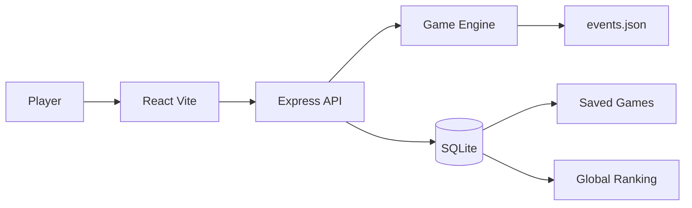

# Architecture

Corporate Survivor is split into frontend, backend, documentation, and Cursor rules. The main design goal is to keep game rules and content independent from the user interface so the project can evolve into new stories, modes, or balancing changes without rewriting screens.

## Folder Boundaries

```text
frontend/
  React application, screens, components, hooks, API client, styling.

backend/
  Express API, SQLite persistence, game engine, event configuration.

docs/
  Architecture, game rules, API contracts, and decisions.

.cursor/rules/
  Project-specific rules used by Cursor agents.
```

Recommended backend substructure:

```text
backend/src/
  server.ts
  routes/
  db/
    connection.ts
    schema.sql
    repositories/
  game/
    engine.ts
    event-loader.ts
    score.ts
    endings.ts
    events.json
    types.ts
```

Recommended frontend substructure:

```text
frontend/src/
  main.tsx
  App.tsx
  api/
  components/
  pages/
  hooks/
  styles/
```

## Runtime Flow



## Responsibilities

### Frontend

- Render the start screen, game screen, ending screen, and global ranking.
- Ask the backend for the current state and available choices.
- Submit the selected choice to the backend.
- Show attributes, day progress, feedback, final score, and ranking.
- Never hardcode events, effects, endings, or progression rules.

### Backend API

- Validate requests and responses.
- Persist players, game state, decisions, final scores, and endings.
- Call the game engine to determine current event, apply choices, and resolve endings.
- Expose ranking data from SQLite.

### Game Engine

- Load event definitions from configuration.
- Select the next unlocked event based on day, slot, attributes, flags, and history.
- Apply choice effects to attributes and flags.
- Detect end conditions.
- Calculate final score and ending.

### SQLite

- Store players.
- Store active and completed games.
- Store every decision applied during a game.
- Support restoring an active game after page reload or browser restart.

## Extensibility Rules

- Adding a new event should require changing only the event configuration file for the active story.
- Adding a new story should require a new configuration file and optional metadata, not a rewrite of the engine.
- Adding a new mode should be modeled as a different game configuration loaded by the same engine.
- Adding a new ending should be done in the ending rules module or ending configuration, without UI changes beyond rendering the returned result.
- UI components must render generic event and choice data returned by the API.

## Persistence Model

The backend should save after every meaningful transition:

1. Player creation.
2. Game start or restart.
3. Choice selection.
4. Attribute and flag update.
5. Event advancement.
6. Game ending and score calculation.

This automatic save model makes "continue game" a normal API read instead of a special browser-only feature.
